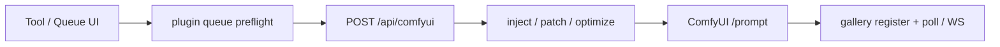

# Architecture

Contributor map of how Prompt Studio is wired. Product setup and feature lists live in the [documentation hub](README.md) and [main README](../README.md).

## Shape

Next.js App Router under `src/app/`, shared UI in `src/components/`, domain logic in `src/lib/`, hooks in `src/hooks/`.

| Layer                         | Responsibility                                                                                                 |
| ----------------------------- | -------------------------------------------------------------------------------------------------------------- |
| **Client**                    | Tool UIs, Dexie settings/history/workflows/gallery, plugin install, Comfy job register + poll/WebSocket        |
| **Server (`src/app/api/**`)** | LLM calls, ComfyUI `/prompt` proxy + inject/preflight, auth/session/ACL, optional JSON under `PROMPT_DATA_DIR` |
| **Edge gate**                 | `src/proxy.ts` — auth, rate limit, usage log before route handlers                                             |

Shell (`src/app/layout.tsx`) wraps pages with `AuthProvider`, `AppNav`, gallery background poller, and storage sync.

## Persistence

### Browser (primary)

IndexedDB via Dexie — database `comfy-prompt-studio-v1` (`src/lib/app-db.ts`):

- `galleryEntries` — Comfy jobs and outputs
- `kv` — settings, prompt history, workflow library, plugins, projects, etc.

Access: `src/lib/browser-storage.ts`, `src/lib/gallery-db-store.ts`, init `src/lib/app-db-init.ts`. Legacy `localStorage` keys migrate into Dexie on first hydrate. Theme/density stay mirrored in `localStorage` for the FOUC script and are also included in `studio-extras` sync.

Durable browser writes listed in `src/lib/durable-sync-keys.ts` schedule a debounced server push.

### Server (optional)

When `PROMPT_DATA_DIR` is set (`src/lib/server-storage.ts`):

- `{PROMPT_DATA_DIR}/{namespace}.json` — namespaces in `src/lib/storage-namespaces.ts`
- Per-user (auth on): `{PROMPT_DATA_DIR}/users/{userId}/…` (`src/lib/user-server-storage.ts`)
- Auth: `{PROMPT_AUTH_DIR|PROMPT_DATA_DIR}/auth/users.json`, `groups.json`, `password-reset-tokens.json` (`src/lib/auth/store.ts`, `src/lib/auth/password-reset-store.ts`)
- Analytics snapshots: `auth/analytics-snapshots.json` (client push via `/api/auth/analytics`)
- SMTP overlay: `email-config.json` (`src/lib/email/store.ts`) — env is the fallback; in-memory overlay if `PROMPT_DATA_DIR` is unset
- Queue-export overlay: `queue-export.json` (`src/lib/queue-export-store.ts`)

**Studio backup** (`src/lib/studio-backup.ts`) is a versioned JSON download (v5) of history, settings, gallery, and `collectStudioExtras()` (gallery ELO and other Dexie KV). It is not a dump of `PROMPT_DATA_DIR`.

**Auto-synced namespaces** (`SYNC_STORAGE_NAMESPACES`): `settings-cache`, `prompt-history`, `comfy-gallery`, `gallery-deleted-ids`, `studio-extras`.

`studio-extras` covers workflows, ComfyUI settings, recipes, projects, webhooks, avoided tokens, templates, campaigns, appearance prefs, onboarding, workspace mode, held-max jobs, notifications, and other durable browser state. Legacy namespaces (`scheduled-batch`, `webhook-settings`, `avoided-tokens`, `prompt-projects`) are folded into `studio-extras` on pull.

Sync helpers: `src/lib/storage-sync.ts`, `src/lib/auto-storage-sync.ts`, `src/lib/studio-extras.ts`, APIs under `src/app/api/storage/**`.

There is no SQLite — server state is JSON files.

## ComfyUI queue path



| Step                                     | Module                                                                    |
| ---------------------------------------- | ------------------------------------------------------------------------- |
| Client POST + early WebSocket `clientId` | `src/lib/comfyui-queue-request.ts`                                        |
| Result-panel queue actions               | `src/hooks/usePromptResultActions.ts`                                     |
| API entry                                | `src/app/api/comfyui/route.ts`                                            |
| URL/workflow resolve + queue             | `src/lib/comfyui-client.ts`                                               |
| Tokens, inject, loaders, images          | `src/lib/comfyui-config.ts`                                               |
| Graph optimize / direct patch            | `src/lib/workflow-queue-optimizer.ts`, `src/lib/workflow-direct-patch.ts` |
| Workflow library (Dexie KV)              | `src/lib/comfyui-workflow-files.ts`                                       |
| Draft / Final / Max (+ per-tool)         | `src/lib/queue-quality-profile.ts`, `src/lib/tool-quality-profiles.ts`    |
| Plugin mutators                          | `src/lib/plugin-queue-hooks.ts`                                           |
| Gallery + progress                       | `src/lib/comfyui-gallery-client.ts`, `src/lib/comfyui-websocket.ts`       |
| Engine seam (queue / progress)           | `src/lib/engine` → `getEngineAdapter()`                                   |

Related routes: `src/app/api/comfyui/{status,history,view,upload,interrupt,live,probe,…}/` and `src/app/api/diffusers/{,status,view,upload}/`.

Pool members: `parseComfyUiPool()` merges `COMFYUI_POOL` with Settings `comfyPoolUrls` after `normalizeComfyPoolUrlList` (allowlist fail-closed per URL). Probe (`POST /api/comfyui/probe`) does not fetch hosts missing from `COMFYUI_ALLOWED_HOSTS`.

## Engine adapter

Thin browser seam for **queue / status / view / upload / progress** so backends can plug in without rewriting gallery or prompt tools.

| Piece                    | Path                                                                         |
| ------------------------ | ---------------------------------------------------------------------------- |
| Interface                | `src/lib/engine/types.ts` (`EngineAdapter`)                                  |
| Comfy implementation     | `src/lib/engine/comfy-adapter.ts`                                            |
| Diffusers implementation | `src/lib/engine/diffusers-adapter.ts`                                        |
| Selection                | `getEngineAdapter()` / `getEngineAdapterById()` in `src/lib/engine/index.ts` |
| Settings                 | `inferenceEngine` + `diffusersApiUrl` (Settings → Inference engine)          |
| Python service           | `services/diffusers-engine/` (optional FastAPI txt2img)                      |

Methods: `postPrompt`, `fetchJobStatus`, `buildViewPath`, `uploadInputImage`, `subscribeProgress`, `openProgressBeforeQueue`.

Backends today:

- **`comfyui`** (default) — primary generate path via `/api/comfyui/*` (Qwen Lightning bf16 + Dynamic VRAM, Final/Max enrich, ControlNet, FaceDetailer, edit, video, custom graphs).
- **`diffusers`** (optional) — experimental txt2img via `/api/diffusers/*` → local FastAPI (`DIFFUSERS_API_URL`, default `http://127.0.0.1:8190`). Opt in from Settings or `PROMPT_ENGINE=diffusers`. On 24GB, Qwen Lightning quality/speed remains Comfy’s strength; Diffusers is not pursued for Dynamic VRAM / bf16 parity.

Diffusers progress is **poll-backed** (no live latent WebSocket). Gallery entries store `comfyUrl` as the engine host and optional `engineId` so poll/view use the correct adapter after the user switches engines.

**In scope of the seam:** engine I/O (queue a job, poll status, proxy pixels, upload inputs, live/poll progress).

**Out of scope (stay studio-owned):** prompt drafting, quality profiles, LoRA stacking, workflow injection/optimize, gallery IndexedDB, interrupt / free / object-info.

Consumers: gallery re-queue (`src/lib/comfyui-requeue.ts`), result-panel send/batch (`src/hooks/usePromptResultActions.ts`), gallery poll (`src/lib/comfyui-gallery-client.ts`).

## Auth and ACL

Enabled when `PROMPT_AUTH_ENABLED=true` or an existing `users.json` is on disk (`src/lib/auth/config.ts`, `src/lib/auth/store.ts`).

Roles (`src/lib/auth/types.ts`): `admin` | `user` | `viewer`.

- **admin** — all features
- **viewer** — `dashboard`, `gallery`, `studio` only
- **user** — all features minus personal + group `blockedFeatures`

Feature IDs and page/API maps: `src/lib/auth/features.ts` (e.g. `/` → `generate`, `/api/comfyui` → `comfyui-api`, LLM routes → `llm-api`).

Gate path: `src/proxy.ts` → `authorizeAppRequest` (`src/lib/auth/access.ts`). Nav filters by `allowedFeatures` from `/api/auth/session` (`src/hooks/useAuth.tsx`, `src/components/AppNav.tsx`).

Session cookie `prompt-studio-session`; also Bearer / `x-prompt-api-token` / per-user API keys.

Invites: `POST /api/auth/invite` (admin) creates or re-sends a user and emails a 1-hour reset token via `src/lib/email/notifications.ts`. Mailer: `src/lib/email/mailer.ts` (transporter rebuilt when SMTP overlay changes).

## Plugins

Installable manifests live in the client settings cache (Dexie), not on the server filesystem (`src/lib/plugin-manifest.ts`).

```ts
{
  id, label, version, enabled?,
  nav?: [{ href, label, description }],
  queueHooks?: { url, events },  // e.g. "queue-preflight"
  tools?: [{ id, title, iframeUrl?, route? }]
}
```

- Nav merges into the sidebar catalog
- Queue hooks run via `runPluginQueuePreflight` before Comfy queue
- Custom tools render at `/plugins/[id]` (`src/app/plugins/[id]/page.tsx`)
- Iframe host protocol (queue / apply-prompt / toast): [plugin-iframe-host.md](plugin-iframe-host.md); example at `/plugin-examples/hello-iframe.html`

Bookmarks (non-manifest) are separate: `src/lib/tool-plugin-registry.ts`. Example hook: `src/app/api/plugin-hooks/denoise-rewrite/route.ts`.

## LLM and vision

| Concern                                  | Where                                                                  |
| ---------------------------------------- | ---------------------------------------------------------------------- |
| Chat / vision client                     | `src/lib/llm-client.ts`                                                |
| Env helpers                              | `src/lib/llm-env.ts`                                                   |
| Vision downscale/recompress before model | `src/lib/vision-image-prepare.ts`                                      |
| Generate / format / refine               | `/api/generate`, `/api/format`, `/api/refine` (+ tool-specific routes) |

LLM routes are gated as `llm-api` when auth is on. Prompt cleanup / thinking-artifact stripping lives in `src/lib/prompt-cleanup.ts`.

## Env categories

See `.env.example` for the full list. Groups that matter for architecture:

| Category    | Examples                                                                             |
| ----------- | ------------------------------------------------------------------------------------ |
| LLM         | `LLM_ENABLED`, `LLM_API_BASE_URL`, `LLM_MODEL`, `LLM_VISION_MODEL`                   |
| ComfyUI     | `COMFYUI_API_URL`, `COMFYUI_POOL`, `COMFYUI_ALLOW_CLIENT_URL`, `COMFYUI_ALLOWED_HOSTS`, `COMFYUI_ROOT` |
| Auth        | `PROMPT_AUTH_ENABLED`, `PROMPT_ADMIN_*`, `PROMPT_SESSION_SECRET`, `PROMPT_API_TOKEN`, `PROMPT_API_URL` |
| Persistence | `PROMPT_DATA_DIR`, `PROMPT_AUTH_DIR`                                                                  |
| Email       | `PROMPT_SMTP_*`, `PROMPT_EMAIL_FROM` (overlay: `email-config.json`)                                    |
| Ops         | `API_RATE_LIMIT_*`, scheduled batch / maintenance flags                                               |

## Where to look next

| Question                                    | Start here                                                                       |
| ------------------------------------------- | -------------------------------------------------------------------------------- |
| Why did queue change my graph?              | `comfyui-config.ts`, `workflow-queue-optimizer.ts`, Settings → workflow takeover |
| Where did this setting go?                  | Dexie `kv` via `browser-storage.ts` / `settings-cache`                           |
| Why is a nav item missing?                  | `auth/features.ts` + user/group `blockedFeatures`                                |
| Why did invite/reset mail use the wrong URL? | `PROMPT_API_URL` — default is `http://127.0.0.1:47832`                          |
| Why did probe fail with allowlist?          | `url-safety.ts` / `COMFYUI_ALLOWED_HOSTS`; copy snippet from cluster panel       |
| Why did a plugin alter queue?               | `plugin-queue-hooks.ts` + installed manifests                                    |
| Refine / vision blew up?                    | `vision-image-prepare.ts`, `llm-client.ts`, `/api/refine`                        |
| Where does queue / progress hit the engine? | `src/lib/engine` (`getEngineAdapter`) — ComfyUI or Diffusers                     |
